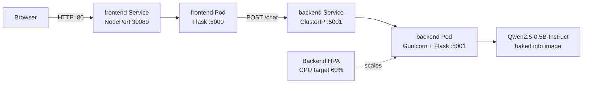

# Qwen Chatbot on Kubernetes

A small, self-contained chatbot that runs
[Qwen2.5-0.5B-Instruct](https://huggingface.co/Qwen/Qwen2.5-0.5B-Instruct) on CPU and
exposes it through a browser-based chat interface. The application is split into a
Flask frontend and a Flask/Gunicorn inference backend, packaged as Docker images,
and deployed to Kubernetes with health probes, resource limits, internal service
discovery, and CPU-based autoscaling.

The backend image downloads and caches the model while the image is built. Once the
image is present on a Kubernetes node, inference runs with Hugging Face Transformers
in offline mode and does not need a Hugging Face token or an internet connection.

## Features

- Browser chat interface with typing and error states
- Qwen2.5-0.5B-Instruct inference on CPU
- Deterministic responses with a 64-token output limit
- Separate frontend and backend containers
- Kubernetes readiness and liveness probes
- Internal backend access through a `ClusterIP` Service
- Frontend access through a `NodePort` Service
- Horizontal Pod Autoscaler (HPA) for the backend
- Model files baked into the backend image for offline runtime use
- Backend pod name returned with each response to make replica routing visible

## Architecture



One chat request follows this path:

1. The browser sends `POST /chat` to the frontend.
2. The frontend validates that the message is not empty.
3. The frontend proxies the request to `http://backend:5001/chat`. Kubernetes DNS
   resolves `backend` to the internal backend Service.
4. The backend formats the message with Qwen's chat template and generates up to
   64 new tokens.
5. The backend returns the reply and its pod hostname.
6. The frontend passes that JSON response to the browser, which displays both the
   reply and the serving pod name.

There is no database, message queue, authentication layer, or conversation storage.
Each message is an independent request containing only the fixed system prompt and
the latest user message.

## Repository layout

```text
.
├── backend/
│   ├── app.py                 # Model loading, health check, and /chat API
│   ├── Dockerfile             # CPU PyTorch image with the model baked in
│   └── requirements.txt       # Flask, Transformers, Accelerate, Gunicorn
├── frontend/
│   ├── app.py                 # Serves the UI and proxies requests to backend
│   ├── Dockerfile             # Lightweight Python frontend image
│   ├── requirements.txt       # Flask and Requests
│   └── static/
│       └── index.html         # Chat UI, styling, and browser-side JavaScript
└── k8s/
    ├── 00-namespace.yaml      # chatbot namespace
    ├── 01-backend-deployment.yaml
    ├── 02-frontend-deployment.yaml
    ├── 03-services.yaml       # Backend ClusterIP and frontend NodePort
    └── 04-hpa.yaml            # CPU-based backend autoscaling
```

## Prerequisites

For the Kubernetes workflow, install:

- [Docker](https://docs.docker.com/get-docker/) or another Minikube-supported
  container runtime
- [Minikube](https://minikube.sigs.k8s.io/docs/start/)
- [kubectl](https://kubernetes.io/docs/tasks/tools/)

Recommended local resources:

- 4 CPU cores
- At least 6 GiB of memory assigned to Minikube
- Several gigabytes of free disk space for PyTorch, Transformers, the model cache,
  and container image layers
- Internet access during the first backend image build

The backend requests `1.5Gi` of memory and has a `2Gi` limit per replica. If the HPA
creates multiple replicas, each replica loads its own copy of the model and needs its
own CPU and memory allocation.

## Quick start with Minikube

Run all commands from the repository root.

### 1. Start the cluster

```bash
minikube start --cpus=4 --memory=6144
```

Enable Metrics Server so the Horizontal Pod Autoscaler can read CPU utilization:

```bash
minikube addons enable metrics-server
```

### 2. Build the images inside Minikube

The Kubernetes manifests use the local image names `chatbot-backend:latest` and
`chatbot-frontend:latest`. Build directly into Minikube's image store so the cluster
can see them:

```bash
minikube image build --tag chatbot-backend:latest ./backend
minikube image build --tag chatbot-frontend:latest ./frontend
```

The first backend build can take several minutes because it installs CPU-only
PyTorch and downloads Qwen2.5-0.5B-Instruct. Later builds can reuse cached Docker
layers as long as the relevant Dockerfile steps have not changed.

Confirm that both images are available to the Minikube node:

```bash
minikube image ls | grep chatbot
```

If the images were already built with the host's Docker daemon, load them instead:

```bash
docker build --tag chatbot-backend:latest ./backend
docker build --tag chatbot-frontend:latest ./frontend
minikube image load chatbot-backend:latest
minikube image load chatbot-frontend:latest
```

### 3. Deploy the application

Create the namespace first, then deploy the application resources:

```bash
kubectl apply -f k8s/00-namespace.yaml
kubectl apply -f k8s/01-backend-deployment.yaml
kubectl apply -f k8s/02-frontend-deployment.yaml
kubectl apply -f k8s/03-services.yaml
kubectl apply -f k8s/04-hpa.yaml
```

Wait for both Deployments to become available:

```bash
kubectl wait --namespace chatbot \
  --for=condition=available deployment/backend \
  --timeout=15m

kubectl wait --namespace chatbot \
  --for=condition=available deployment/frontend \
  --timeout=5m
```

Inspect the deployed resources:

```bash
kubectl get all --namespace chatbot
kubectl get hpa --namespace chatbot
```

### 4. Open the chat interface

Ask Minikube for the frontend Service URL:

```bash
minikube service frontend --namespace chatbot --url
```

Open the printed URL in a browser. Depending on the Minikube driver and operating
system, this command may keep a tunnel open; leave that terminal running while using
the application.

An alternative that works consistently across Minikube drivers is port forwarding:

```bash
kubectl port-forward --namespace chatbot service/frontend 8080:80
```

Then open <http://localhost:8080>.

## Run with Docker only

Kubernetes is not required for basic local testing. Build the images and attach both
containers to the same Docker network:

```bash
docker build --tag chatbot-backend:latest ./backend
docker build --tag chatbot-frontend:latest ./frontend

docker network create chatbot-network

docker run --detach \
  --name chatbot-backend \
  --network chatbot-network \
  --publish 5001:5001 \
  --env NUM_THREADS=4 \
  chatbot-backend:latest

docker run --detach \
  --name chatbot-frontend \
  --network chatbot-network \
  --publish 5000:5000 \
  --env BACKEND_URL=http://chatbot-backend:5001 \
  chatbot-frontend:latest
```

Open <http://localhost:5000> and follow logs with:

```bash
docker logs --follow chatbot-backend
docker logs --follow chatbot-frontend
```

When finished:

```bash
docker rm --force chatbot-frontend chatbot-backend
docker network rm chatbot-network
```

## Run directly with Python

This workflow downloads the model when the backend starts unless it is already in
the local Hugging Face cache.

Create one virtual environment and install both applications' dependencies:

```bash
python3 -m venv .venv
source .venv/bin/activate

python -m pip install --upgrade pip
python -m pip install torch --index-url https://download.pytorch.org/whl/cpu
python -m pip install -r backend/requirements.txt
python -m pip install -r frontend/requirements.txt
```

Start the backend in the first terminal:

```bash
source .venv/bin/activate
NUM_THREADS=4 python backend/app.py
```

Start the frontend in a second terminal:

```bash
source .venv/bin/activate
BACKEND_URL=http://127.0.0.1:5001 python frontend/app.py
```

Open <http://localhost:5000>.

## API reference

### Frontend API

The frontend is the public application boundary.

#### `GET /`

Returns the browser chat interface.

#### `GET /health`

Used by the frontend Deployment's readiness probe.

```json
{
  "status": "ok"
}
```

#### `POST /chat`

Validates the message and proxies it to the backend.

Request:

```json
{
  "message": "Explain Kubernetes Services in simple terms."
}
```

Successful response:

```json
{
  "reply": "A Kubernetes Service gives a stable network address to a group of pods...",
  "pod": "backend-7f8c9d6b5f-example"
}
```

Possible frontend errors include:

- `400` when `message` is empty
- `504` when backend inference takes longer than 300 seconds
- `500` when the frontend cannot reach the backend or receives another upstream
  error

Example through a local port-forward:

```bash
curl --request POST http://localhost:8080/chat \
  --header 'Content-Type: application/json' \
  --data '{"message":"What is a Kubernetes pod?"}'
```

### Backend API

The backend is intended to remain internal to the cluster.

#### `GET /health`

Used by the backend readiness and liveness probes.

```json
{
  "status": "ok",
  "pod": "backend-7f8c9d6b5f-example"
}
```

#### `POST /chat`

Accepts the same request shape as the frontend endpoint. It returns `400` if the
message is empty and `200` with the generated reply otherwise.

To test it without exposing the backend permanently:

```bash
kubectl port-forward --namespace chatbot service/backend 5001:5001
```

In another terminal:

```bash
curl --request POST http://localhost:5001/chat \
  --header 'Content-Type: application/json' \
  --data '{"message":"Hello!"}'
```

## Configuration

### Backend environment variables

| Variable | Default | Purpose |
| --- | --- | --- |
| `MODEL_ID` | `Qwen/Qwen2.5-0.5B-Instruct` | Hugging Face model identifier. In offline containers it must match a model already present in the baked cache. |
| `HF_HOME` | Hugging Face default | Cache directory. The image and Deployment set it to `/app/hf_cache`. |
| `TRANSFORMERS_OFFLINE` | Not set outside Docker | When `1`, prevents Transformers from trying to download model files at runtime. |
| `NUM_THREADS` | Available CPU count, or `4` | Number of PyTorch compute and interop threads. Kubernetes explicitly sets it to `4`. |
| `PORT` | `5001` | Port used only when running `python backend/app.py`; the container's Gunicorn command binds directly to port `5001`. |

### Frontend environment variables

| Variable | Default | Purpose |
| --- | --- | --- |
| `BACKEND_URL` | `http://backend:5001` | Base URL used to proxy chat requests to the backend. |
| `PORT` | `5000` | Frontend Flask listening port. |

## Kubernetes resources

| Resource | Name | Purpose |
| --- | --- | --- |
| Namespace | `chatbot` | Isolates all application resources. |
| Deployment | `backend` | Runs one CPU inference container initially. |
| Deployment | `frontend` | Runs the web UI and proxy container. |
| Service | `backend` | Internal `ClusterIP` on port `5001`. |
| Service | `frontend` | `NodePort` service on port `80`, mapped to node port `30080`. |
| HPA | `backend-hpa` | Scales the backend from 1 to 3 replicas around 60% average requested CPU utilization. |

The backend CPU request is `500m`, so the HPA's 60% utilization target corresponds
to approximately `300m` average CPU use per backend pod. Scaling only works when a
resource metrics provider such as Metrics Server is running.

## Development workflow

After changing application code, rebuild the affected image inside Minikube and
restart its Deployment:

```bash
minikube image build --tag chatbot-frontend:latest ./frontend
kubectl rollout restart deployment/frontend --namespace chatbot
kubectl rollout status deployment/frontend --namespace chatbot
```

For a backend change:

```bash
minikube image build --tag chatbot-backend:latest ./backend
kubectl rollout restart deployment/backend --namespace chatbot
kubectl rollout status deployment/backend --namespace chatbot --timeout=15m
```

The manifests explicitly set `imagePullPolicy: IfNotPresent`, which is appropriate
for images stored locally in Minikube. For a shared or production cluster, publish
versioned images to a registry and replace the local image names in the Deployments,
for example:

```yaml
image: registry.example.com/team/chatbot-backend:v1.0.0
```

Versioned tags make rollouts and rollbacks more predictable than repeatedly updating
the `latest` tag.

## Observability and useful commands

List pods and see which node runs them:

```bash
kubectl get pods --namespace chatbot --output wide
```

Follow application logs:

```bash
kubectl logs --namespace chatbot deployment/backend --follow
kubectl logs --namespace chatbot deployment/frontend --follow
```

Inspect Services and their selected endpoints:

```bash
kubectl get services,endpoints --namespace chatbot
```

Inspect autoscaling and resource metrics:

```bash
kubectl get hpa --namespace chatbot --watch
kubectl top pods --namespace chatbot
```

Review recent namespace events in chronological order:

```bash
kubectl get events --namespace chatbot --sort-by=.lastTimestamp
```

## Troubleshooting

### `ErrImagePull` or `ImagePullBackOff`

Symptoms commonly look like:

```text
container "frontend" in pod "frontend-..." is waiting to start:
trying and failing to pull image
```

The Deployment references an unqualified local image such as
`chatbot-frontend:latest`. Building it in the host Docker daemon does not necessarily
make it available inside Minikube. When the node cannot find the image locally, it
tries to pull it from a public registry and fails.

Inspect the exact pull error:

```bash
kubectl get pods --namespace chatbot
kubectl describe pod --namespace chatbot <pod-name>
```

Build or load the missing image into Minikube, then restart the Deployment:

```bash
minikube image build --tag chatbot-frontend:latest ./frontend
kubectl rollout restart deployment/frontend --namespace chatbot
kubectl rollout status deployment/frontend --namespace chatbot
```

Use the corresponding backend commands if `chatbot-backend:latest` is missing. On a
shared cluster, push the image to an accessible registry and configure an
`imagePullSecret` if that registry is private.

### Backend stays unready

The model is loaded before the backend starts serving requests. Check the logs and
pod events:

```bash
kubectl logs --namespace chatbot deployment/backend
kubectl describe pod --namespace chatbot --selector app=backend
```

Look for:

- `OOMKilled`, which means the node or container does not have enough memory
- `FailedScheduling`, which means no node satisfies the resource request
- model cache errors, often caused by changing `MODEL_ID` without baking that model
  into the image
- `exec format error`, which indicates an image/CPU architecture mismatch

If Minikube is undersized, recreate or reconfigure it with more memory and CPU.

### Frontend cannot reach the backend

Confirm the backend pod is ready and the Service has an endpoint:

```bash
kubectl get pods --namespace chatbot --selector app=backend
kubectl get service backend --namespace chatbot
kubectl get endpoints backend --namespace chatbot
```

The frontend Deployment must use:

```text
BACKEND_URL=http://backend:5001
```

If the Service has no endpoints, the backend pod is not ready or its labels no longer
match the Service selector `app: backend`.

### HPA shows `<unknown>` metrics

Verify Metrics Server is enabled and becomes ready:

```bash
minikube addons enable metrics-server
kubectl get deployment metrics-server --namespace kube-system
kubectl top pods --namespace chatbot
```

Metrics can take a short time to appear after the add-on or application pods start.

### The NodePort URL does not open

Use Minikube's Service helper or a port-forward instead of assuming that
`localhost:30080` is reachable with every driver:

```bash
minikube service frontend --namespace chatbot --url
```

or:

```bash
kubectl port-forward --namespace chatbot service/frontend 8080:80
```

## Current limitations and production considerations

This repository is designed as a local deployment example. Before exposing it to
untrusted users, consider the following:

- There is no authentication, authorization, TLS termination, or rate limiting.
- User input length is not capped, which can increase latency and memory usage.
- The system prompt and generation settings are hard-coded in `backend/app.py`.
- Conversations are not persisted and prior turns are not sent to the model.
- The frontend returns raw exception text in some `500` responses.
- The frontend uses Flask's development server rather than a production WSGI server.
- Requests are synchronous; each backend worker handles inference inline.
- Every backend replica keeps a separate full model copy in memory.
- Dependency versions are not pinned, so future image builds may resolve different
  package versions.
- There are currently no automated tests, CI pipeline, ingress, persistent storage,
  centralized logs, metrics dashboards, or distributed tracing.

For production use, add input limits, structured error responses, authentication,
TLS at an Ingress or gateway, pinned dependencies, automated tests, monitoring, and a
versioned image release process.

## Cleanup

Remove all application resources by deleting the namespace:

```bash
kubectl delete namespace chatbot
```

Stop Minikube while preserving its cluster state:

```bash
minikube stop
```

Delete the entire local cluster and its stored images when they are no longer needed:

```bash
minikube delete
```

## Further reading

- [Minikube: Pushing images](https://minikube.sigs.k8s.io/docs/handbook/pushing/)
- [Minikube image commands](https://minikube.sigs.k8s.io/docs/commands/image/)
- [Kubernetes: Horizontal Pod Autoscaling](https://kubernetes.io/docs/tasks/run-application/horizontal-pod-autoscale/)
- [Kubernetes: Services](https://kubernetes.io/docs/concepts/services-networking/service/)
- [Qwen2.5-0.5B-Instruct model card](https://huggingface.co/Qwen/Qwen2.5-0.5B-Instruct)
